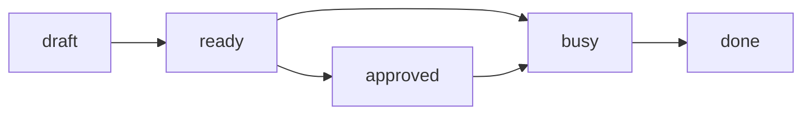

# A page, as the editor draws it

The page is the document: warm, generous, set in a reading face at a reading
size. Everything around it is the ledger. This paragraph is prose; the
frontmatter above it is hidden behind a button, and the status it carries
is drawn as a badge in the page head.

## What a plan is made of

- A seed, quoted from the human who wrote it
- An approach, with the alternative that lost given a sentence
- An implementation guide, whose boxes tick as the work lands

| status | means | next move |
| ------ | ----- | --------- |
| draft | someone wrote it down | an agent fleshes it out |
| ready | it would hold up | a session implements it |
| busy | being implemented now | whoever claimed it |
| done | a record | the human archives it |

```ts
// Code, and only code, gets hue: five inks held below full saturation.
export function needsOf(entry: Entry, login: string): Need[] {
  const me = login.toLowerCase();
  const asked = handleList(entry.reviewers).includes(me);
  return asked ? [{ reason: "review", count: 1 }] : [];
}
```

> [!NOTE]
> An alert is a blockquote whose first line names its kind. Five kinds, five inks.

> [!WARNING]
> The ochre one is for something that will go wrong if ignored.



A comment is an HTML comment in the markdown, signed by whoever wrote it, and
the app draws it as a card in the margin of the paragraph it follows.

<!--
@bob: Is the table the right shape for this?
@alice: Yes, it mirrors the skill.
-->

A suggestion is a comment with a diff in it: the text it wants gone, a lone
separator, the text it wants instead.

<!--
@claude suggests:
A suggestion is a comment with a diff in it: the text it wants gone, a lone
separator, the text it wants instead.
---
A suggestion is a comment carrying a diff: the old text, one separator line,
and the text proposed in its place.
-->
